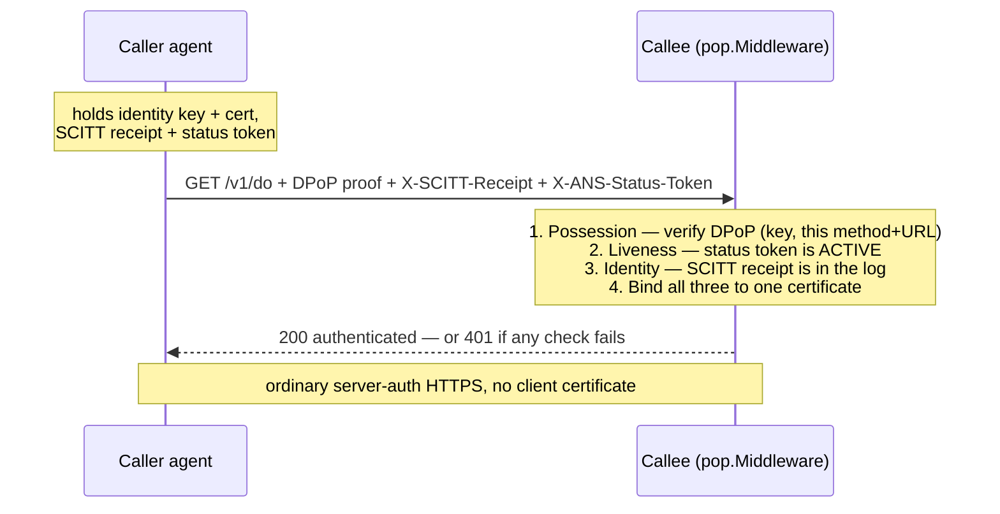

# Agent-to-Agent authentication without mTLS

A working proof of concept: one ANS agent authenticates to another over plain
HTTP — **no mutual TLS, no client certificate** — by presenting a
sender-constrained **DPoP proof** ([RFC 9449](https://datatracker.ietf.org/doc/html/rfc9449))
alongside the SCITT receipt and status token that ANS already issues.

## Why

ANS agents authenticate to each other today with mTLS client certificates.
mTLS breaks through L7 proxies and gateways (they terminate TLS and drop the
client identity), carries no delegation semantics, and is heavy to operate.
This moves the caller's identity proof up to the application layer, where it
survives every hop.

## How it works — three proofs, one new

A caller proves three things, all bound to one identity certificate:

| Proof | Answers | Provided by |
|-------|---------|-------------|
| **Identity** | Is the caller's certificate in the transparency log? | SCITT receipt *(existing)* |
| **Liveness** | Is that certificate currently valid (ACTIVE, not revoked)? | status token *(existing)* |
| **Possession** | Does the caller hold the key — for *this* request? | **DPoP proof _(new)_** |

Authorization is a separate question, and out of scope here: a non-nil
`CallerIdentity` means "this request provably came from `ans://…X`", never "X
may do this." See [OAuth 2.0 on top](#oauth-20-on-top-optional).

SCITT already provides the first two. The DPoP proof adds the third — the part
the mTLS handshake used to provide. The three are bound together so they
describe the **same** agent: the proof's certificate fingerprint must be in the
status token, the certificate's `ans://` name must match the status token's
name, and the receipt must name the same agent.

## The flow



A stolen receipt + status token (both public) are useless without the private
key, and the proof's `jti` + method + URL + timestamp stop replay and
redirection.

## The DPoP proof — construction & wire format

The proof is a **compact JWS** — `base64url(header).base64url(payload).base64url(signature)`
— carried in a `DPoP` request header. Here is a real one, minted by `pop.Signer`
and decoded.

**Header** pins the algorithm and carries the key twice: the bare public key in
`jwk` (required by RFC 9449 §4.2, so any conformant DPoP verifier can validate
the proof) and the caller's ANS identity certificate in `x5c[0]` (DER,
standard-base64), which ties that key to the agent's `ans://` name:

```json
{
  "typ": "dpop+jwt",
  "alg": "ES256",
  "jwk": {"kty":"EC","crv":"P-256","x":"l8tFrhx-34tV3hRICRDY9zCkDlpBhF42UQUfWVAWBFs","y":"9VE4jf_Ok_o64zbTTlcuNJajHmt6v9TDVrU0CdvGRDA"},
  "x5c": ["MIIBbzCCARWgAwIBAgIBAT…‹ANS identity cert DER›…MBiqZ/psLao+w="]
}
```

The two MUST present the same key. The verifier compares them byte-for-byte
before it does any signature work, so the signature is only ever checked under
one key and a swapped `jwk` fails closed.

**Payload** binds the proof to this exact request:

```json
{
  "htm": "GET",
  "htu": "https://callee.example/v1/do",
  "iat": 1700000000,
  "jti": "4063b9d16e68177201e9cf4df596374a"
}
```

| Claim | Meaning |
|-------|---------|
| `htm` | the HTTP method |
| `htu` | normalized target URL — lowercase scheme+host, default port dropped, empty path normalized to `/`, query/fragment stripped (RFC 9449 §4.3) |
| `iat` | issued-at, unix seconds; the callee accepts ±120 s |
| `jti` | 128-bit single-use id (16 random bytes, hex); the callee caches it to reject replays |
| `ath` | *only when an OAuth2 access token is presented* — `base64url(SHA-256(token))` |

**On the wire**, the three base64url segments are joined with dots (one line in
reality, ~950 bytes — most of it the certificate):

```
eyJ0eXAiOiJkcG9wK2p3dCIsImFsZyI6IkVTMjU2IiwieDVj…                ← header
.eyJodG0iOiJHRVQiLCJodHUiOiJodHRwczovL2NhbGxlZS5leGFtcGxlL…     ← payload
.6z3B3uTk_BWgr0XsvOlg7YOPwSUIPhnQj7zEzeTbw2sIFf91gpYdCFRMU0J-fxhDgTpN6cAp2vE7rQSLw4O7nw   ← ES256 signature (R‖S)
```

**How `pop.Signer` creates it:**

1. Normalize the request URL → `htu`.
2. Mint a fresh `jti` — 16 random bytes, hex.
3. Build the header: `typ`/`alg` pinned, the identity certificate DER (std-base64) in `x5c[0]`.
4. Build the payload: `htm`, `htu`, `iat = now`, `jti`.
5. `signingInput = base64url(header) + "." + base64url(payload)` — the exact ASCII bytes.
6. `signature = ECDSA-P256( SHA-256(signingInput) )`, written as fixed-width R‖S (64 bytes), base64url.
7. Join the three segments with dots.

**The full request** carries the proof plus the two SCITT headers:

```http
GET /v1/do HTTP/1.1
Host: callee.example
DPoP:               ‹compact JWS above›
X-SCITT-Receipt:    ‹base64(COSE_Sign1 receipt)›
X-ANS-Status-Token: ‹base64(COSE_Sign1 status token)›
```

**Profile note (vs. textbook DPoP).** These are wire-conformant RFC 9449
proofs — a textbook §4.3 verifier validates them through `jwk` and ignores the
`x5c`. The profile adds two restrictions the RFC lets a deployment impose:
ES256 only, and no JOSE header parameters beyond `{typ, alg, jwk, x5c}`
(strict decoding, so a private-key `d` member, a smuggled `kid`, or a second
certificate in `x5c` all fail closed). Where textbook DPoP gets its identity
binding from an authorization server stamping the key's thumbprint into an
access token, this profile gets it from the identity certificate and the
transparency log — so it works with no authorization server at all.

## OAuth 2.0 on top (optional)

ANS proves **who** the caller is; OAuth2 grants **what** it may do. They
compose, and the composition is the RFC's, unchanged.

When a request presents a DPoP-bound access token, the token is sent under the
`DPoP` auth scheme rather than `Bearer` (RFC 9449 §7.1), and the proof gains an
`ath` claim over the token:

```http
GET /v1/do HTTP/1.1
Host: callee.example
DPoP:               ‹proof, now including "ath"›
Authorization:      DPoP ‹access token›
X-SCITT-Receipt:    ‹base64(COSE_Sign1 receipt)›
X-ANS-Status-Token: ‹base64(COSE_Sign1 status token)›
```

RFC 9449 §4.3 requires **two** checks here, and they land in different places:

| Check | Who does it |
|-------|-------------|
| `ath` equals `SHA-256(access token)` | `pop.Middleware`, automatically |
| the token's `cnf.jkt` equals the proof key's thumbprint | **your handler** |

The second one cannot be delegated to `pop`, because the token is opaque to it —
only the component that validates the token can read `cnf`. It also cannot be
skipped: `ath` is a hash of a value the presenter already holds, so a thief who
steals a token can mint a matching `ath` under their own key. `CallerIdentity.JKT`
is the proof key's RFC 7638 thumbprint, and `(*Signer).JKT()` is the same value on
the client, for requesting a bound token:

```go
id, _ := pop.CallerFromContext(r.Context())            // pop authenticated the caller
tok, ok := pop.AccessTokenFromAuthorization(r.Header.Get("Authorization"))
if !ok {
    // no DPoP-bound token presented; ANS identity alone
}
at, err := validateAccessToken(tok)                     // YOUR issuer/exp/aud checks first
if err != nil || at.Cnf.JKT != id.JKT {                 // then the key binding
    http.Error(w, "forbidden", http.StatusForbidden)
    return
}
```

Use `pop.AccessTokenFromAuthorization` rather than parsing the header yourself:
`Middleware` verified `ath` against exactly the bytes it returns, and a
handler-local parser that disagreed would read "no token" and skip the `cnf.jkt`
comparison on a request `pop` had already accepted the token for.

[`server/main.go`](server/main.go) implements exactly this, and the demo's
`stolentoken` scenario shows a fully authenticated agent being refused with 403
because it presented a token issued to another agent's key.

## Deployment note: the `htu` authority

`htu` is only as trustworthy as the URL the callee compares it against. The
fallback derives that from the request's `Host` header, which the client
controls — so a proof captured from a call to another origin would satisfy the
check. Every deployment sets one of:

```go
pop.Middleware(keys, replay, pop.WithTrustedHosts("callee.example:443"))
pop.Middleware(keys, replay, pop.WithExternalURL(fromTrustedProxyHeader))
```

`pop` logs a warning at startup when neither is configured, and panics if a
`WithExternalURL` function ignores the request path (which would collapse `htu`
to a constant and stop it binding the target at all). Scenario 5 of the
**single-process** demo sends a proof minted for `victim.example` with a matching
spoofed `Host` and shows it rejected.

Note that `WithTrustedHosts` takes the *externally-visible* authority callers
dial, not the bind address — a service listening on `:8443` or `0.0.0.0:8443`
never sees either of those as a `Host`. The demo server keeps them as separate
flags (`--addr` and `--external-host`) to make the distinction concrete.

## Deployment note: the replay cache

`MemoryReplayCache` rejects a reused proof only within one process. Behind a load
balancer, a captured proof replays successfully against any instance that has not
seen it, for as long as it stays fresh — `2 × DefaultPoPSkew`, four minutes at
the defaults. Multi-instance deployments need a shared `ReplayCache` (Redis
`SET NX PX`, or a DynamoDB conditional put); the interface is one atomic
`CheckAndStore` method.

Size it deliberately, too. Every accepted proof holds a slot until it expires, so
capacity must cover the in-flight window:

```
maxEntries ≥ peakRequestsPerSecond × (popSkew + replayGrace) × headroom
```

At the defaults that is about 800 req/s. Above it the cache fills with still-live
entries and fails closed — 401 for **every** caller, not just the noisy one —
which is the correct trade (evicting a live entry would reopen replay) but a bad
surprise if unplanned.

## Test it

From the repository root:

```bash
# Two processes over a real socket (callee server + caller client), with logs:
bash examples/a2a-no-mtls/run.sh

# Or the single-process version:
go run ./examples/a2a-no-mtls
```

You'll see five scenarios. `component=caller` is the calling agent;
`component=pop` is the callee's verifier:

```
component=caller  sending request with DPoP proof + SCITT receipt/status headers  method=GET url=…/v1/do
component=pop     possession proof verified (DPoP)    jti=98f9… htu=…/v1/do fingerprint=3ce4…
component=pop     liveness verified (status token)    ansName=ans://… status=ACTIVE
component=pop     identity verified (SCITT receipt)   leafIndex=0 treeSize=1
component=pop     caller authenticated                ansName=ans://… agentId=agent-demo-1
component=caller  authenticated over plain HTTP, no mTLS  status=200
```

1. **Authenticated call** → `200`.
2. **Replayed proof** (same `jti`) → `401` (`category=REPLAY`).
3. **No identity** (no DPoP / SCITT headers) → `401` (`category=MISSING_HEADERS`).
4. **DPoP-bound access token** issued to our key → `200`, scope honored.
5. **Token issued to another agent's key** → `403` on the `cnf.jkt` mismatch.

The single-process demo (`go run ./examples/a2a-no-mtls`) covers a different
five: authenticated, replayed, method-tampered, wrong-peer, and a proof minted
for another origin presented with a spoofed `Host`.

## What's here

| Path | Role |
|------|------|
| [`../../pop/`](../../pop/) | the library: DPoP sign/verify, the three-proof `VerifyCaller`, the HTTP `Middleware` |
| [`demokit/`](demokit/) | mints the demo credentials an ANS RA/TL would normally provision |
| [`server/`](server/) | the callee — an HTTP server fronted by `pop.Middleware` |
| [`client/`](client/) | the caller — loads its bundle, attaches a proof, calls |
| [`main.go`](main.go) | the single-process version of the same demo |
| [`run.sh`](run.sh) | builds and runs the two-process demo |

## Scope

This is a proof of concept.

- It runs over **plain HTTP** to keep the focus on the application-layer auth.
  Production uses HTTPS; the proof is independent of the TLS layer.
- `demokit` stands in for a live `ans-ra` / `ans-tl`. A real deployment fetches
  the receipt and status token from the TL and trusts the published `/root-keys`.
- It covers the **autonomous** model (one agent calling another). Delegation
  (an agent acting on behalf of a user across a call chain) is a separate step.
